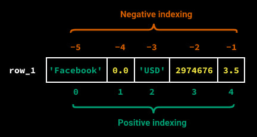

## Array and List

1. Array

- Arrays in python is provided by array built in modules.
- Arrays are a more efficient way to store a sequence of elements of the same data type.
- Commonly used types in arrays are 'i' for integers, 'f' for float, etc.
- store homogenous collection of items - all items have the same data type.

Example:

```
import array
arr = array.array('i', [1, 2, 3, 4, 5])
```

 
2. List

- store hetrogenous data
- Lists in Python are more versatile and can store elements of different data types.
- Lists come built-in with Python, and they are implemented as dynamic arrays behind the scenes.
- example:

```
my_list = [1, 2, 3, 4, 5]
print(my_list)
```



## Data Types in NumPy

3. NumPy

It has some extra data types, and refer to data types with one character, like i for integers, u for unsigned integers etc.

_Below is a list of all data types in NumPy and the characters used to represent them._

- i - integer
- b - boolean
- u - unsigned integer
- f - float
- c - complex float
- m - timedelta
- M - datetime
- O - object
- S - string
- U - unicode string
- V - fixed chunk of memory for other type ( void )

## ASSIGNMENT


