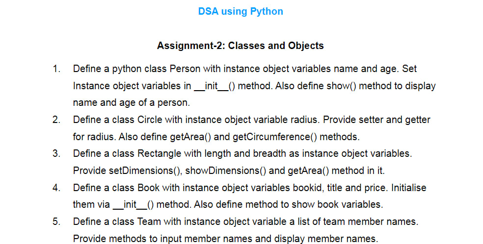

## CLASS AND OBJECTS

Python is an object oriented programming language.

In Python, everything is an Object and class is a blueprint for creating objects(a particular data structure) in the program.

It has classes and objects which are the building blocks It uses classes and objects to create user-defined.
Almost everything in Python is an object, with its properties and methods.

A Class is like an object constructor, or a **"blueprint"** for creating objects.

Example:

```
class Person:
    std="sixth"

    def __init__(self,name):
        self.name=name
        self.std=std
    def showdeatils(self):
        return f"My name is {self.name} and I`m Studing in {self.std}"
boy1=Person("Mukesh")
```

For more example open <a href="code_practise.py"> `code_practise.py`. </a>

## Assignment


